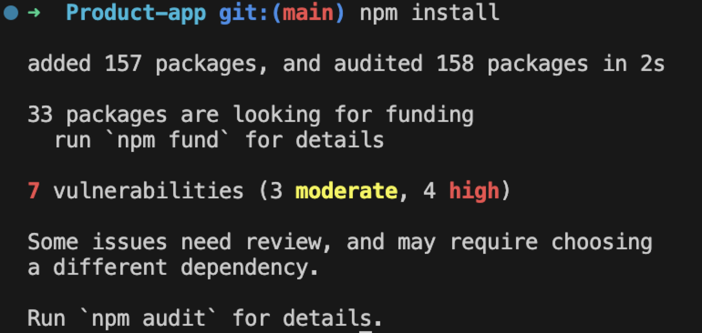
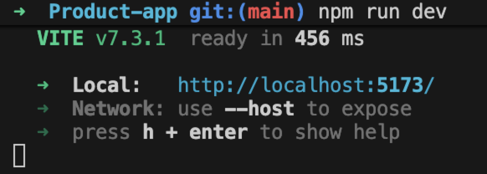

# Product App

This project is using React + Vite

Author: Cathy Cheng

## To run this code
Install npm:

```bash
npm install
```



After install, run dev:

```bash
npm run dev
```


Then, open the local url:


